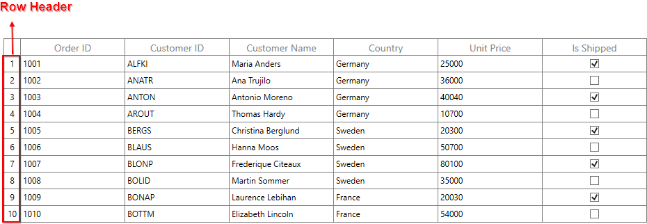
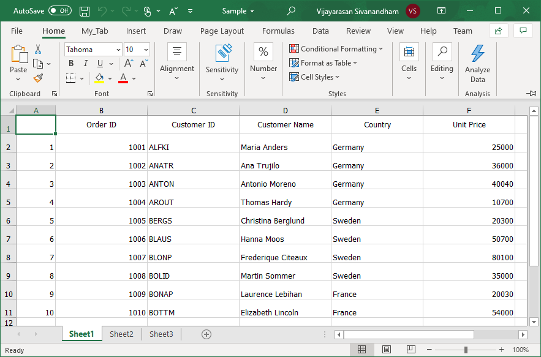

# Export DataGrid to XLSX

> A focused WPF sample showing how to export a Syncfusion `SfDataGrid` to Excel (`.xlsx`) — including the row header column.


## Overview

This is a small WPF demo that exports a [Syncfusion `SfDataGrid`](https://www.syncfusion.com/wpf-controls/datagrid) to an Excel workbook with a single button click.

The `SfDataGrid` does not export its **row header** out of the box. This sample shows the workaround: export the grid with `SfGridConverter`, then manually insert a column into the generated worksheet (`Worksheet.InsertColumn`) and fill it with the row indices so the exported sheet matches what the user sees on screen.

The grid is bound to a small in-memory list of orders (Order ID, Customer ID, Customer Name, Country, Unit Price, Is Shipped) via a simple MVVM `ViewModel`.

## Features

- One-click export of an `SfDataGrid` to `.xlsx` (and `.xls`).
- Manually re-creates the **row header column** that `SfDataGrid` omits on export.
- Lets the user pick the Excel format via a Save dialog: Excel 97–2003 (`.xls`), Excel 2007–2010 (`.xlsx`), or Excel 2013 (`.xlsx`).
- Offers to open the saved workbook in the default Excel viewer after export.

## Usage

The export logic lives in `MainWindow.xaml.cs` (`btnExportToExcel_Click`). The core idea:

```csharp
// 1. Export the grid to an in-memory Excel engine
var options = new ExcelExportingOptions { ExcelVersion = ExcelVersion.Excel2013 };
var excelEngine = sfDataGrid.ExportToExcel(sfDataGrid.View, options);
var workBook = excelEngine.Excel.Workbooks[0];
IWorksheet sheet = workBook.Worksheets[0];

// 2. SfDataGrid does not export the row header — insert it manually
sheet.InsertColumn(1, 1, ExcelInsertOptions.FormatDefault);
var rowcount = this.sfDataGrid.RowGenerator.Items.Count;
for (int i = 1; i < rowcount; i++)
{
    sheet.Range["A" + (i + 1).ToString()].Number = i;
}

// 3. Save to the path chosen in the SaveFileDialog
workBook.SaveAs(stream);
```

The row header is enabled on the grid in XAML with `ShowRowHeader="True"`.

### Screenshots

Row header displayed in the `SfDataGrid`:



Exported Excel sheet with the row header column:



## Tech Stack

- **Language:** C#
- **UI:** WPF (.NET Framework 4.6)
- **Pattern:** MVVM (`Model` / `ViewModel`)
- **Excel export:** Syncfusion XlsIO (`Syncfusion.XlsIO.Base`) via `Syncfusion.SfGridConverter.WPF`
- **Grid:** Syncfusion `SfDataGrid` (`Syncfusion.SfGrid.WPF`)

## Getting Started

### Prerequisites

- Windows with Visual Studio 2015 or later.
- Syncfusion WPF assemblies, referenced by the project:
  - `Syncfusion.SfGrid.WPF`
  - `Syncfusion.SfGridConverter.WPF`
  - `Syncfusion.XlsIO.Base`
  - `Syncfusion.Compression.Base`
  - `Syncfusion.Data.WPF`
  - `Syncfusion.Shared.WPF`

### Run

1. Clone the repository.
2. Open `SfDataGridDemo.sln` in Visual Studio.
3. Restore / reference the Syncfusion assemblies listed above (e.g. via the Syncfusion Essential Studio for WPF installation or NuGet).
4. Build and run. Click **Export To Excel**, choose a location and format, then save.

## Notes

- This is a focused demonstration sample, not a packaged library.
- Syncfusion is a commercial component suite; you need the Syncfusion WPF assemblies (and, for production use, a valid Syncfusion license) to build and run this project.
- The row header is reconstructed in the exported sheet because `SfDataGrid` does not include it in the standard export.

---
<p align="center">Built by <b>Mohamed Habib Khattat</b> — <a href="https://github.com/MohamedKhattat">GitHub</a> · <a href="https://www.linkedin.com/in/mohamed-habib-khattat-2b206a173">LinkedIn</a></p>
